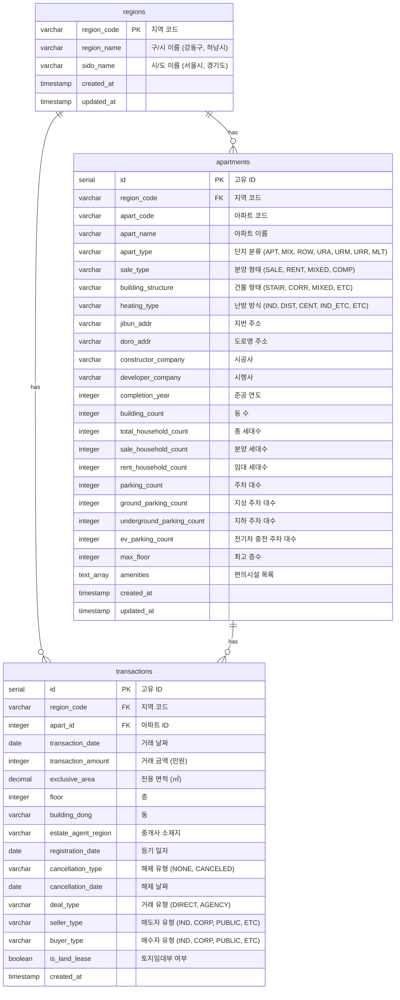

# 집사요 DB 스키마

## ERD (Entity Relationship Diagram)



## 코드 정의

### apart_type (단지 분류)
| 코드 | 설명 |
|------|------|
| APT | 아파트 |
| MIX | 주상복합 |
| ROW | 연립주택 |
| URA | 도시형 생활주택(아파트) |
| URM | 도시형 생활주택(주상복합) |
| URR | 도시형 생활주택(연립주택) |
| MLT | 다세대 |

### sale_type (분양 형태)
| 코드 | 설명 |
|------|------|
| SALE | 분양 |
| RENT | 임대 |
| MIXED | 혼합 |
| COMP | 사택 및 관사 |

### building_structure (건물 형태)
| 코드 | 설명 |
|------|------|
| STAIR | 계단식 |
| CORR | 복도식 |
| MIXED | 혼합식 |
| ETC | 기타 |

### heating_type (난방 방식)
| 코드 | 설명 |
|------|------|
| IND | 개별난방 |
| DIST | 지역난방 |
| CENT | 중앙난방 |
| IND_ETC | 개별난방+기타 |
| ETC | 기타 |

### deal_type (거래 유형)
| 코드 | 설명 |
|------|------|
| DIRECT | 직거래 |
| AGENCY | 중개거래 |

### seller_type / buyer_type (거래 주체)
| 코드 | 설명 |
|------|------|
| IND | 개인 |
| CORP | 법인 |
| PUBLIC | 공공기관 |
| ETC | 기타 |

### cancellation_type (해제 유형)
| 코드 | 설명 |
|------|------|
| NONE | 해당없음 |
| CANCELED | 해제 |

## 인덱스

```sql
-- apartments
CREATE INDEX idx_apartments_region ON apartments(region_code);
CREATE INDEX idx_apartments_name ON apartments(apart_name);

-- transactions
CREATE INDEX idx_transactions_region_date ON transactions(region_code, transaction_date DESC);
CREATE INDEX idx_transactions_apart_date ON transactions(apart_id, transaction_date DESC);
CREATE INDEX idx_transactions_date ON transactions(transaction_date DESC);
```

## 제약조건

```sql
-- apartments: 지역 내 아파트 코드 유니크
UNIQUE(region_code, apart_code)

-- transactions: 동일 거래 중복 방지
UNIQUE(apart_id, transaction_date, exclusive_area, floor, building_dong, transaction_amount)
```
