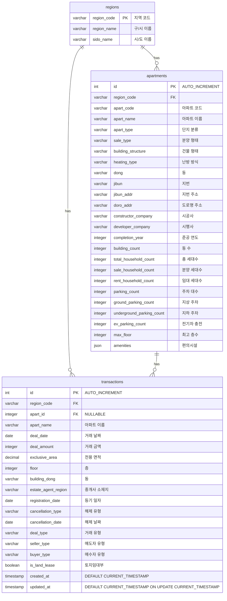

# 집사요 DB 스키마

## ERD (Entity Relationship Diagram)



## 코드 정의

### apart_type (단지 분류)

| 코드 | 설명                      |
| ---- | ------------------------- |
| APT  | 아파트                    |
| MIX  | 주상복합                  |
| ROW  | 연립주택                  |
| URA  | 도시형 생활주택(아파트)   |
| URM  | 도시형 생활주택(주상복합) |
| URR  | 도시형 생활주택(연립주택) |
| MLT  | 다세대                    |

### sale_type (분양 형태)

| 코드  | 설명         |
| ----- | ------------ |
| SALE  | 분양         |
| RENT  | 임대         |
| MIXED | 혼합         |
| COMP  | 사택 및 관사 |

### building_structure (건물 형태)

| 코드  | 설명   |
| ----- | ------ |
| STAIR | 계단식 |
| CORR  | 복도식 |
| MIXED | 혼합식 |
| ETC   | 기타   |

### heating_type (난방 방식)

| 코드    | 설명          |
| ------- | ------------- |
| IND     | 개별난방      |
| DIST    | 지역난방      |
| CENT    | 중앙난방      |
| IND_ETC | 개별난방+기타 |
| ETC     | 기타          |

### deal_type (거래 유형)

| 코드   | 설명     |
| ------ | -------- |
| DIRECT | 직거래   |
| AGENCY | 중개거래 |

### seller_type / buyer_type (거래 주체)

| 코드   | 설명     |
| ------ | -------- |
| IND    | 개인     |
| CORP   | 법인     |
| PUBLIC | 공공기관 |
| ETC    | 기타     |

### cancellation_type (해제 유형)

| 코드     | 설명     |
| -------- | -------- |
| NONE     | 해당없음 |
| CANCELED | 해제     |

## SQL 스키마

```sql
-- 지역 테이블
CREATE TABLE regions (
    region_code VARCHAR(10) PRIMARY KEY,
    region_name VARCHAR(50) NOT NULL,
    sido_name VARCHAR(50) NOT NULL
);

-- 아파트 테이블
CREATE TABLE apartments (
    id INT AUTO_INCREMENT PRIMARY KEY,
    region_code VARCHAR(10) NOT NULL,
    apart_code VARCHAR(32) NOT NULL,
    apart_name VARCHAR(100) NOT NULL,
    apart_type VARCHAR(10),
    sale_type VARCHAR(10),
    building_structure VARCHAR(10),
    heating_type VARCHAR(10),
    dong VARCHAR(20),
    jibun VARCHAR(20),
    jibun_addr VARCHAR(500),
    doro_addr VARCHAR(500),
    constructor_company VARCHAR(100),
    developer_company VARCHAR(100),
    completion_year INTEGER,
    building_count INTEGER,
    total_household_count INTEGER,
    sale_household_count INTEGER,
    rent_household_count INTEGER,
    parking_count INTEGER,
    ground_parking_count INTEGER,
    underground_parking_count INTEGER,
    ev_parking_count INTEGER,
    max_floor INTEGER,
    amenities JSON,
    UNIQUE(region_code, apart_code),
    FOREIGN KEY (region_code) REFERENCES regions(region_code)
);

-- 거래내역 테이블
CREATE TABLE transactions (
    id INT AUTO_INCREMENT PRIMARY KEY,
    region_code VARCHAR(10) NOT NULL,
    apart_id INTEGER NULL,
    apart_name VARCHAR(100) NOT NULL,
    deal_date DATE NOT NULL,
    deal_amount INTEGER NOT NULL,
    exclusive_area DECIMAL(10,4),
    floor INTEGER,
    building_dong VARCHAR(20),
    estate_agent_region VARCHAR(50),
    registration_date DATE,
    cancellation_type VARCHAR(10),
    cancellation_date DATE,
    deal_type VARCHAR(10),
    seller_type VARCHAR(10),
    buyer_type VARCHAR(10),
    is_land_lease BOOLEAN DEFAULT FALSE,
    created_at TIMESTAMP DEFAULT CURRENT_TIMESTAMP,
    updated_at TIMESTAMP DEFAULT CURRENT_TIMESTAMP ON UPDATE CURRENT_TIMESTAMP,
    FOREIGN KEY (region_code) REFERENCES regions(region_code),
    FOREIGN KEY (apart_id) REFERENCES apartments(id)
);

-- 인덱스
CREATE INDEX idx_apartments_region ON apartments(region_code);
CREATE INDEX idx_apartments_name ON apartments(apart_name);
CREATE INDEX idx_transactions_region_date ON transactions(region_code, deal_date DESC);
CREATE INDEX idx_transactions_apart_date ON transactions(apart_id, deal_date DESC);
CREATE INDEX idx_transactions_date ON transactions(deal_date DESC);
```
